# Living up to the promise of Darwin Core RDF — *SPARQLing GBIF*

**2026 GBIF Ebbe Nielsen Challenge submission.**

GBIF occurrence data (and the taxonomic backbone) converted from Parquet to **RDF** and served on the open-source **QLever** SPARQL engine with **geoSPARQL** — making the whole of GBIF queryable in standard SPARQL, on cheap hardware, and **federatable** with Wikidata and OpenStreetMap. We show it works with live demos and two small, AI-built web apps.

## Submitters

| Role | Name | ORCID | Affiliation (country) |
|------|------|-------|------------------------|
| Primary contact | **Andra Waagmeester** | [orcid:0000-0001-9773-4008](https://orcid.org/0000-0001-9773-4008) | Micelio (BE) · Maastricht University (NL) |
| | Hannah Bast | [orcid:0000-0003-1213-6776](https://orcid.org/0000-0003-1213-6776) | University of Freiburg (DE) |
| | Jerven Bolleman | [orcid:0000-0002-7449-1266](https://orcid.org/0000-0002-7449-1266) | SIB Swiss Institute of Bioinformatics (CH) |
| | Tiago Lubiana | [orcid:0000-0003-2473-2313](https://orcid.org/0000-0003-2473-2313) | University of São Paulo (BR) |
| | Robert Hoehndorf | [orcid:0000-0001-8149-5890](https://orcid.org/0000-0001-8149-5890) | KAUST (SA) |

*(affiliations/countries best-effort — please verify before submitting)*

## Videos
- 🎬 **Submission film (≤5 min):** *<add YouTube link once uploaded>*
- ▶️ **Companion tool screencast (Tiago Lubiana):** https://youtu.be/vKqK2SePcXY

## Try it live
| Demo | Link | Repo |
|------|------|------|
| SPARQL UI over GBIF (QLever) | https://ui.qlever.dev/gbif | — |
| EU invasive-species spread (year-animated map) | https://www.micelio.be/eu-invasive-spread-gbif/ | [Micelio/eu-invasive-spread-gbif](https://github.com/Micelio/eu-invasive-spread-gbif) |
| Occurrences inside/outside nature reserves (GBIF × OSM) | https://tiago.bio.br/gbif_sparql/ | [lubianat/gbif_sparql](https://github.com/lubianat/gbif_sparql) |

## How it works (data pipeline)
1. **GBIF occurrence + backbone Parquet → RDF** with the `gbif_parquet` converter (≈261 GB of occurrences in the simple Parquet export).
2. **Hosted on QLever** with geoSPARQL support, on modest hardware. Public endpoint: `https://qlever.dev/api/gbif` (UI: `https://ui.qlever.dev/gbif`).
3. **Federation** with Wikidata (`https://qlever.dev/api/wikidata`) and OpenStreetMap (`https://qlever.dev/api/osm-planet`) for cross-graph and spatial questions.
4. **Apps** consume the live endpoint directly from the browser — no backend, no cloud bill, no login.

## Operating instructions (quick start)
- **Run a query:** open https://ui.qlever.dev/gbif, paste an example from [`sparql/examples.md`](sparql/examples.md), press **Execute**.
- **See it on a map:** run a query that returns `?geometry` (bound to `wdt:P625`) and click **Map view**.
- **Spatial GBIF × OSM** (e.g. *lions outside protected areas*): run on the **`osm-planet`** endpoint (`https://ui.qlever.dev/osm-planet`) — pulls GBIF points in via `SERVICE`. See [`sparql/examples.md`](sparql/examples.md) §6.
- **Spread app:** open the EU invasive-species app, pick a species, press **Load & play** to watch its spread across Europe year by year (with its Wikidata photo and GBIF/iNaturalist/NCBI identifiers).
- **Reserve app:** open Tiago's tool, type a taxon, choose "Nature reserves only", press **Map it**.

## SPARQL examples
Full, tested query set: [`sparql/examples.md`](sparql/examples.md). Highlights:
1. Cross-kingdom **homonyms** (1,769 pairs; e.g. *Oenanthe* — a bird *and* a plant).
2. Occurrences → **Map view** (heatmap).
3. **GBIF × OSM** — occurrences inside / outside **nature reserves** (federated geoSPARQL; e.g. lions outside protected areas).
4. **EU Union-list** of Invasive Alien Species → GBIF backbone audit (synonyms + coverage gaps).

Demo running order: [`storyboard.md`](storyboard.md).

## Repositories & data
- **This repo** — the umbrella submission.
- **Spread app** — [Micelio/eu-invasive-spread-gbif](https://github.com/Micelio/eu-invasive-spread-gbif)
- **Reserve tool** — [lubianat/gbif_sparql](https://github.com/lubianat/gbif_sparql) (by Tiago Lubiana)
- **Parquet → RDF** — `gbif_parquet` converter · **QLever** engine — https://github.com/ad-freiburg/qlever
- **Data** — GBIF occurrence download (Parquet) + GBIF backbone; OpenStreetMap; Wikidata. All open.

---

## Appendix A — the explainer cartoon (scenes + narration)
The submission film opens with a short animated explainer. Scene-by-scene, with the narration transcript:

| Scene | Still | Narration |
|------:|-------|-----------|
| 1 | 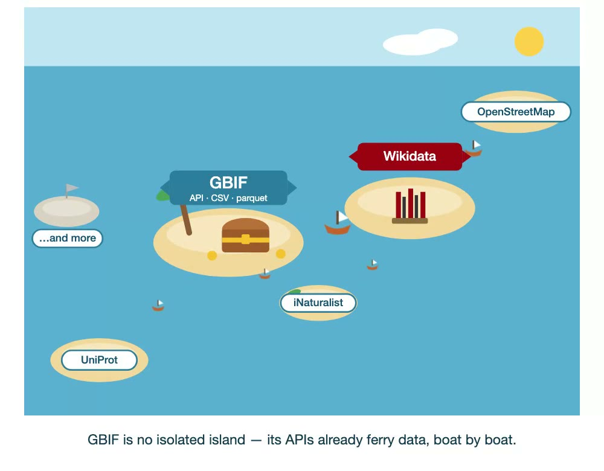 | GBIF is a treasure trove — the FAIR home for biodiversity occurrence data, built on Darwin Core. And it's far from isolated: its APIs already ferry data out every day, boat by boat. But each connection is its own trip, one question at a time. We wanted bridges. |
| 2 | 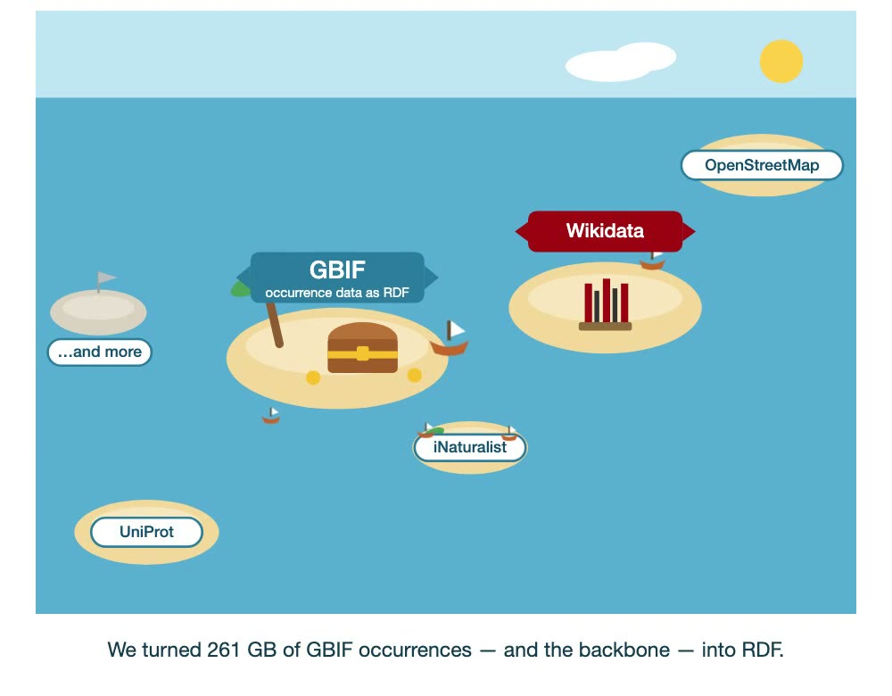 | So we took 261 gigabytes of GBIF occurrences, in its Parquet files, with the taxonomic backbone, and turned them into RDF. |
| 3 | 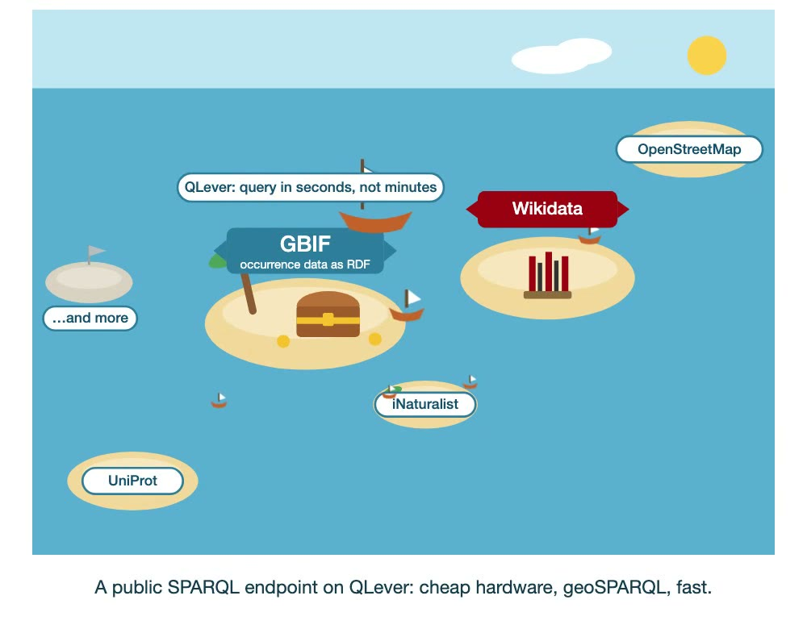 | We serve it through a public SPARQL endpoint on the open-source QLever engine, with geoSPARQL support, on cheap hardware — fast, with no cloud bill, no quota, and no login. |
| 4 | 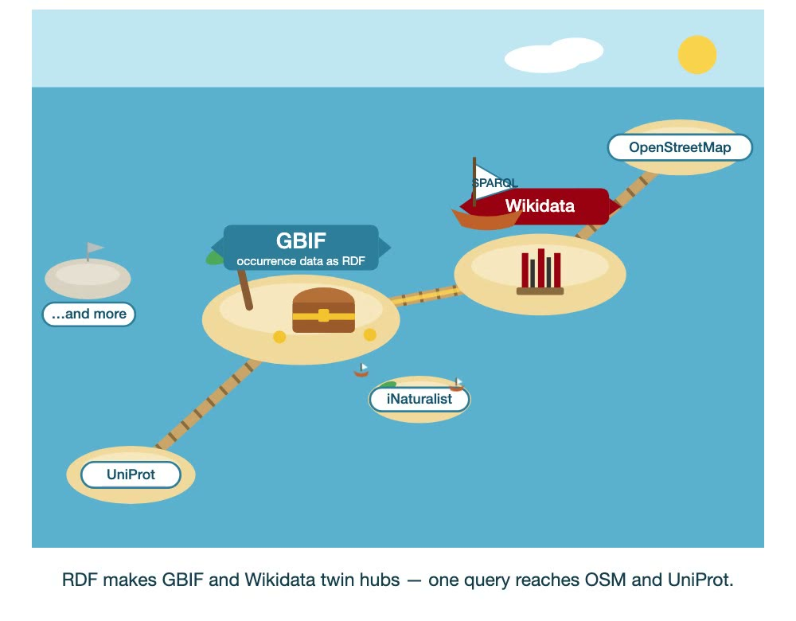 | Now GBIF and Wikidata become twin hubs — a single federated query reaches OpenStreetMap and UniProt, all at once. While a few, like iNaturalist, are still only a boat away. |
| 5 | 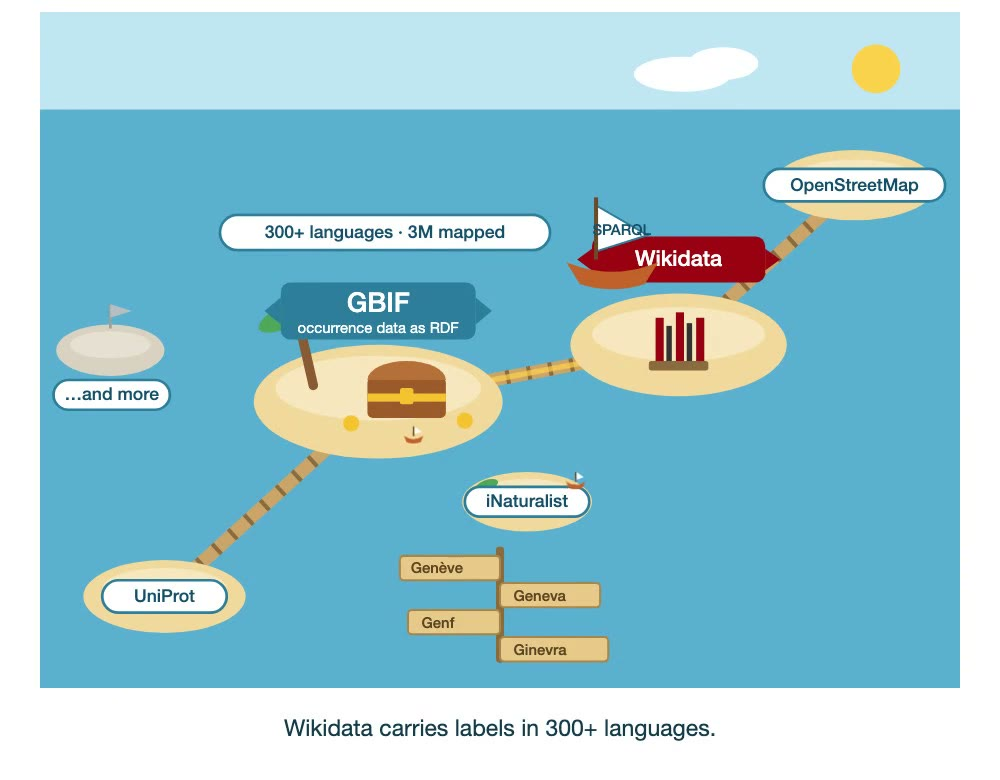 | RDF also breaks the language barrier — Wikidata carries labels in over three hundred languages. |
| 6 | 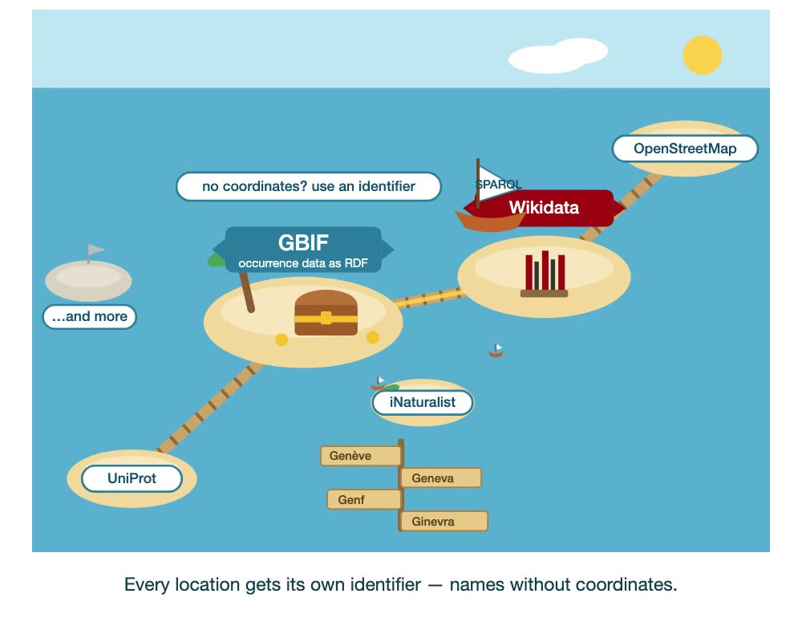 | And we give every location its own identifier, so one place can carry the names people actually use — even when it has no coordinates. |
| 7 | 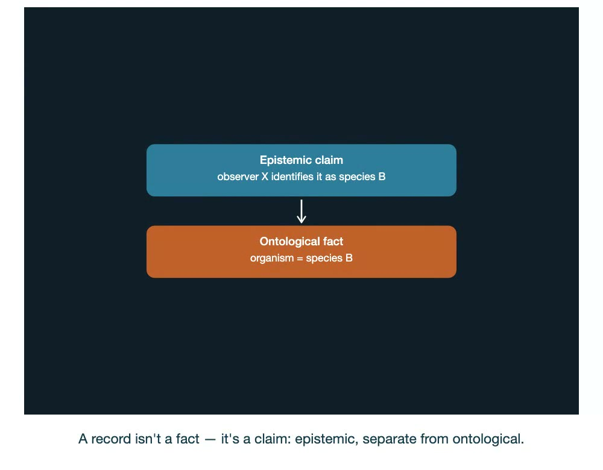 | A record isn't a fact about the world — it's a claim by someone. By separating the epistemic from the ontological, we can track provenance, and even detect contradicting identifications. |
| 8 | 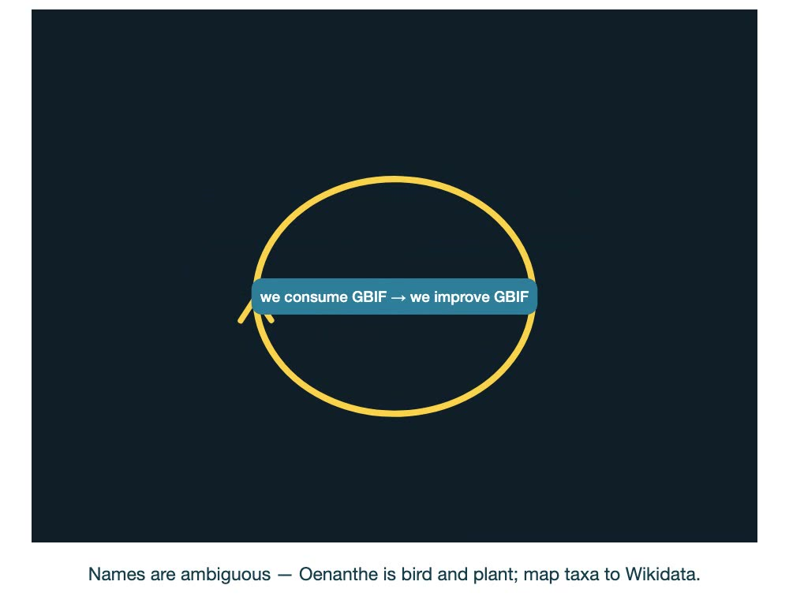 | Names alone are ambiguous — *Oenanthe* is both a bird and a plant; there are over seventeen hundred such cross-kingdom homonyms. Mapping each GBIF taxon to a Wikidata identifier resolves them — and three-quarters already are. |
| 9 | 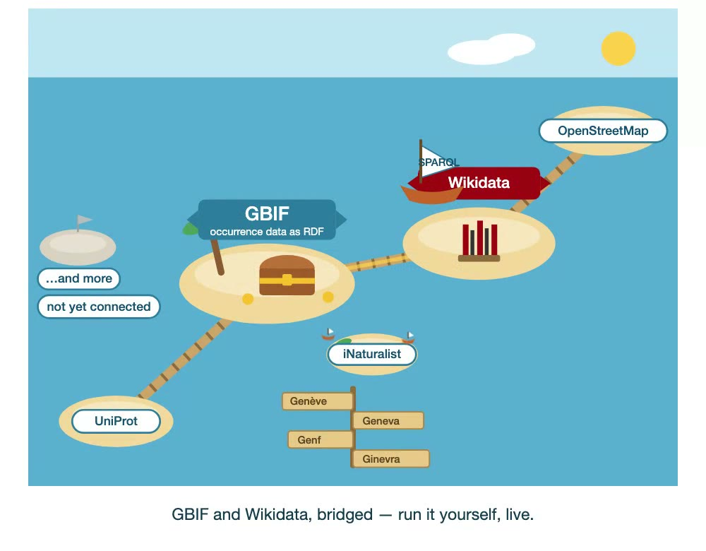 | GBIF and Wikidata, bridged: open, fast, federated, multilingual, and provenance-aware. And you can run all of it yourself, live — like this. |

## Appendix B — live query screens
| Query | Screen |
|-------|--------|
| Cross-kingdom homonyms (gbif) | 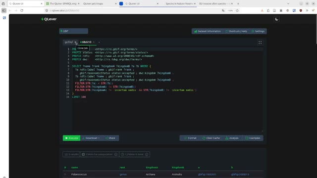 |
| Lions outside protected areas (gbif × osm-planet) | 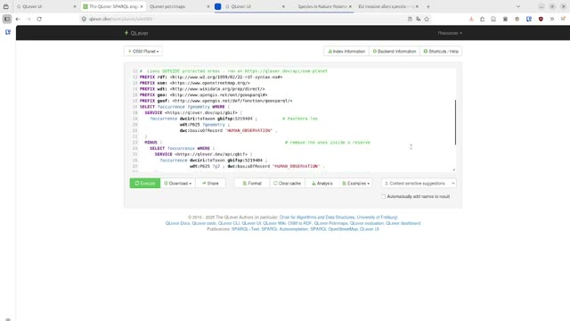 |
| EU Union-list resolver (gbif) | 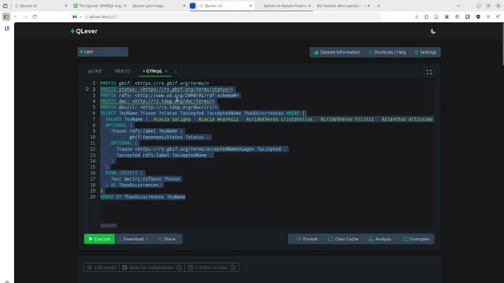 |

---
*Endpoint: `https://qlever.dev/api/gbif` · Basemaps © OpenStreetMap, © CARTO · QLever by the Chair for Algorithms and Data Structures, University of Freiburg.*
